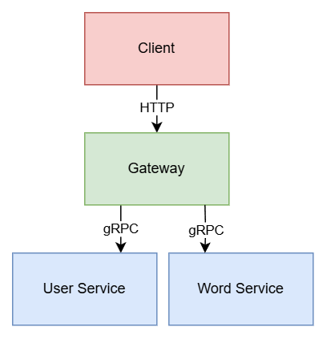

**比邻英语本**是一个帮助用户学习英语单词的轻量级软件，它包含以下业务功能：
- 用户注册；
- 用户登录；
- 用户信息查询；
- 单词的增删改查。

我们将这些服务简单地拆分，将同类功能放在一起，演化出两个微服务：
- 用户服务：处理用户注册、登录、信息查询等功能；
- 单词服务：提供单词相关的功能，比如增删改查。

微服务不直接对外提供服务，而是统一交由网关处理。网关作为一个`Web`服务，它不直接提供具体的业务功能，而是负责接收请求，转发到各微服务，最后拼接数据返回，以此来完成业务功能。

网关的功能不仅限于协议转换，还包括负载均衡、认证授权、日志记录、监控和限流等。微服务之间通常使用`HTTP`或`gRPC`进行通讯。

本书微服务采用`gRPC`协议。

## 代码仓库
---
微服务将单体服务拆开，代码也自然分离。它的代码仓库，有两种常见的管理方式：
- **Polyrepo：** 多仓库模式，每个微服务都有独立的仓库。优点是每个仓库相对较小，易于管理。缺点是需要额外的工具，流程协调各个服务之间的依赖和版本。
- **Monorepo：** 单一仓库模式，所有微服务的代码都存放在一个仓库中。优点是可以统一管理版本和依赖，缺点是仓库可能会变得庞大，管理复杂度增加。

我们的项目采用`Monorepo`模式。`Polyrepo`模式下一个服务一个目录，无需多言。
