如果你已经对`MVC`有所了解，那么可以跳过本节。如果你是新手，则需要了解一下`MVC（Model-View-Controller）`程序设计架构。

`MVC`将应用程序分成三个主要部分：Model、View 和 Controller。

- **Model（模型）**：负责应用程序的数据和业务逻辑。直接管理数据、逻辑和规则。与数据库进行交互，处理数据的存储和检索。
- **View（视图）**：负责显示数据和用户界面。直接与用户交互，展示数据和接收用户输入。更新显示以反映模型的最新状态。
- **Controller（控制器）**：负责处理用户输入和请求。从视图接收输入并处理后，更新模型或视图。作为模型和视图之间的中介，协调它们的交互。

因为我们已经进行了前后端分离，实际上`View`层是交由前端处理的。我们只需要注重`Controller`和`Model`层即可。需要说明的是，`MVC`只是一种设计思想，不必深究于此。