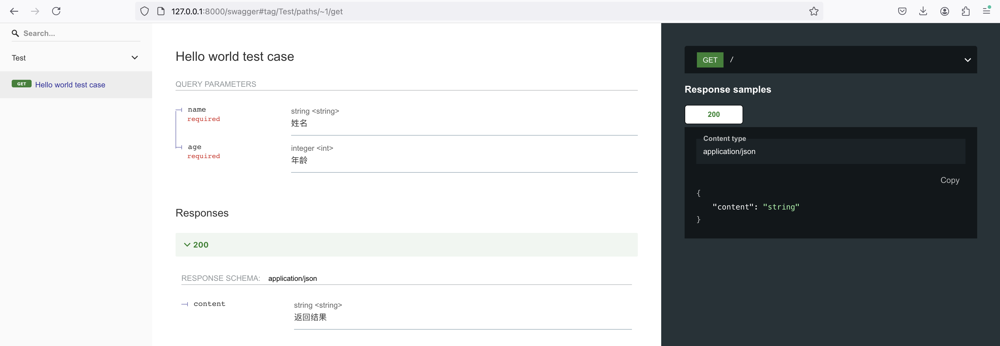

使用`GoFrame`框架自动化生成接口文档非常简单。

我们首先对前面章节的接口数据结构进行简单的完善，以便生成的接口文档更加优雅。

## 接口定义完善

```go
type HelloReq struct {
    g.Meta `path:"/" method:"get" tags:"Test" summary:"Hello world test case"`
    Name   string `v:"required" json:"name" dc:"姓名"`
    Age    int    `v:"required" json:"age"  dc:"年龄"`
}
type HelloRes struct {
    Content string `json:"content" dc:"返回结果"`
}
```

可以看到，基于前面章节的接口数据结构定义，我们在其`g.Meta`中增加了两个标签：
- `tags`: 该接口属于哪个分类，或者接口模块。
- `summary`: 接口描述。

:::info
这些标签都是`OpenAPIv3`标准接口协议的规范字段，在开发手册对应章节有关于接口文档生成以及标签的详细讲解，我们这里不作过多介绍。
:::

## 完整代码示例

```go title="main.go"
package main

import (
    "context"
    "fmt"

    "github.com/gogf/gf/v2/frame/g"
    "github.com/gogf/gf/v2/net/ghttp"
)

type Response struct {
    Message string      `json:"message" dc:"消息提示"`
    Data    interface{} `json:"data"    dc:"执行结果"`
}

type HelloReq struct {
    g.Meta `path:"/" method:"get" tags:"Test" summary:"Hello world test case"`
    Name   string `v:"required" json:"name" dc:"姓名"`
    Age    int    `v:"required" json:"age"  dc:"年龄"`
}
type HelloRes struct {
    Content string `json:"content" dc:"返回结果"`
}

type Hello struct{}

func (Hello) Say(ctx context.Context, req *HelloReq) (res *HelloRes, err error) {
    res = &HelloRes{
        Content: fmt.Sprintf(
            "Hello %s! Your Age is %d",
            req.Name,
            req.Age,
        ),
    }
    return
}

func Middleware(r *ghttp.Request) {
    r.Middleware.Next()

    var (
        msg string
        res = r.GetHandlerResponse()
        err = r.GetError()
    )
    if err != nil {
        msg = err.Error()
    } else {
        msg = "OK"
    }
    r.Response.WriteJson(Response{
        Message: msg,
        Data:    res,
    })
}

func main() {
    s := g.Server()
    s.Group("/", func(group *ghttp.RouterGroup) {
        group.Middleware(Middleware)
        group.Bind(
            new(Hello),
        )
    })
    s.SetOpenApiPath("/api.json")
    s.SetSwaggerPath("/swagger")
    s.SetPort(8000)
    s.Run()
}
```
在本示例中：
- 通过`s.SetOpenApiPath("/api.json")`启用`OpenAPIv3`的接口文档生成，并指定生成的文件路径`/api.json`。
- 通过`s.SetSwaggerPath("/swagger")`启用内置的`Swagger`接口文档UI，并指定客访问的UI地址为`/swagger`。内置的`Swagger UI`可自定义修改，具体可参考开发手册相应章节。

### 关于`OpenAPIv3`

`OpenAPIv3`是目前业内的接口文档标准协议，用于接口文档的定义，通常使用`json`格式生成。该接口文档`json`文件可以用许多接口`UI`展示工具打开，例如`Swagger UI/PostMan/ApiFox`等等。

### 关于`Swagger`

`Swagger`是常用的接口文档UI展示工具，支持多种接口文档格式，最常用的接口文档格式当然是`OpenAPIv3`。

在本示例中，如果需要使用内置的`Swagger UI`查看接口文档，需要同时启用`OpenAPIv3`和`Swagger UI`。即调用`SetOpenApiPath`和`SetSwaggerPath`方法设置对应的访问路径。

## 执行结果


### 终端输出

执行后，终端输出：
```html
2024-10-28 21:56:42.747 [INFO] pid[87280]: http server started listening on [:8000]
2024-10-28 21:56:42.747 [INFO] {d84db2976ea202187ba40f5d0657e4d7} swagger ui is serving at address: http://127.0.0.1:8000/swagger/
2024-10-28 21:56:42.747 [INFO] {d84db2976ea202187ba40f5d0657e4d7} openapi specification is serving at address: http://127.0.0.1:8000/api.json

  ADDRESS | METHOD |   ROUTE    |                        HANDLER                        |    MIDDLEWARE      
----------|--------|------------|-------------------------------------------------------|--------------------
  :8000   | GET    | /          | main.(*Hello).Say                                     | main.Middleware    
----------|--------|------------|-------------------------------------------------------|--------------------
  :8000   | ALL    | /api.json  | github.com/gogf/gf/v2/net/ghttp.(*Server).openapiSpec |                    
----------|--------|------------|-------------------------------------------------------|--------------------
  :8000   | ALL    | /swagger/* | github.com/gogf/gf/v2/net/ghttp.(*Server).swaggerUI   | HOOK_BEFORE_SERVE  
----------|--------|------------|-------------------------------------------------------|--------------------
```

我们可以看到，终端输出的提示信息发生了一些变化：
- 终端输出了`swagger`的地址`http://127.0.0.1:8000/swagger/`点击该地址可以直接打开`Swagger UI`界面。
- 终端输出了`openapi`的接口文档地址`http://127.0.0.1:8000/api.json`，该地址文件可以使用很多接口文档UI查看工具打开。
- 路由信息也多了两行地址，对应的是`swagger`和`openapi`的地址。

### `Swagger UI`

我们点击`swagger`地址 http://127.0.0.1:8000/swagger/ 查看：



 - 由于我们只定义了一个接口，所以`Swagger`页面只看一个接口定义，在`Test`分类下展示的具体的接口名称`Hello world test case`。

- 在接口详情中，展示了接口的输入与输出数据结构。甚至对于输入的数据结构，`GoFrame`生成的接口文档能够自动识别其校验规则，比如是否必需参数。并展示了各个参数的数据类型、参数描述。


## 学习总结

通过本章节的学习，我们学习到了以下几点知识：
- 通过对路由接口进行规范化的输入输出数据结构定义，可以很好地维护接口，特别是业务较复杂、接口比较多的项目。
- 通过`GoFrame`框架自动化接口文档生成特性，可以很方便地生成基于`OpenAPIv3`标准化的接口文档、`Swagger UI`展示页面，极大降低接口维护成本、提高服务间协作效率。


