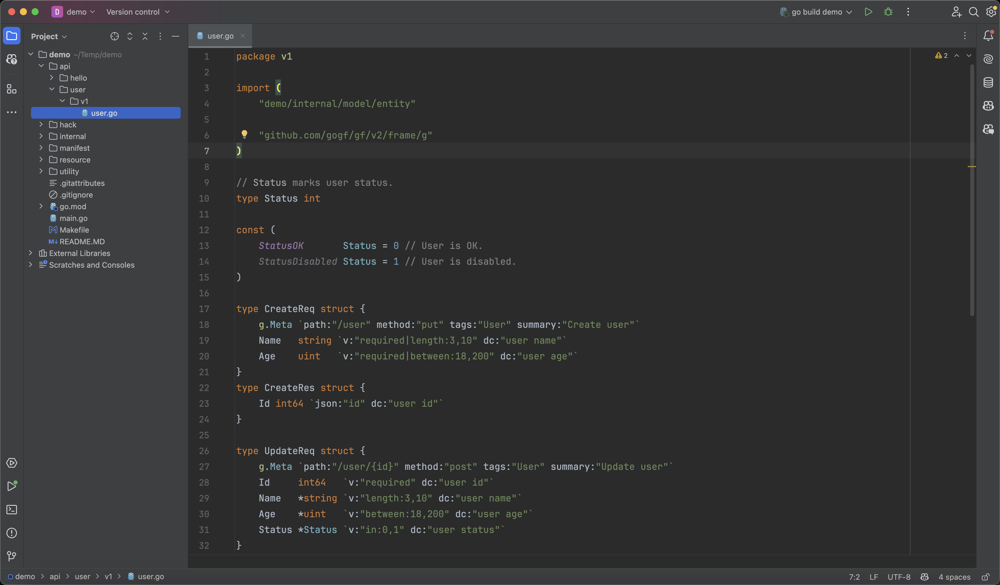

在项目的`api`目录下，我们开始定义我们的`CURD`接口。
- 接口我们使用`RESTful`风格设计，充分使用`GET/PUT/POST/DELETE`的`HTTP Method`，这样规范设计的接口会非常优雅。
- 同样的，我们默认开始使用`v1`版本。使用版本号做为良好的开发习惯，有利于未来接口的兼容性维护。



## 创建接口
```go title="api/user/v1/user.go"
type CreateReq struct {
    g.Meta `path:"/user" method:"put" tags:"User" summary:"Create user"`
    Name   string `v:"required|length:3,10" dc:"user name"`
    Age    uint   `v:"required|between:18,200" dc:"user age"`
}
type CreateRes struct {
    Id int64 `json:"id" dc:"user id"`
}
```
简要介绍：
- 接口定义中，使用`g.Meta`来管理接口的元数据信息，这些元数据信息通过标签的形式定义在`g.Meta`属性上。这里的元数据信息包括：`path`路由地址、`method`请求方式、`tags`接口分组(用于生成接口文档)、`summary`接口描述。这些元数据信息都是`OpenAPIv3`里面的东西，我们这里不做详细介绍，大家了解即可，感兴趣可以参考章节：[接口文档-OpenAPIv3](../../../docs/WEB服务开发/接口文档/接口文档-OpenAPIv3.md)。
- 这里的`Name`和`Age`属性即是咱们接口的参数定义。其中`dc`标签是`description`的缩写，表示参数的含义；`v`标签是`valid`得缩写，表示参数的校验规则。我们这里使用到了`3`条内置的校验规则：
  - `required`：该参数是必需参数。
  - `length`：参数的长度校验。
  - `between`：参数的大小校验。
  - 这里仅做了解即可，更多的校验规则请参考章节 [数据校验-校验规则](../../../docs/核心组件/数据校验/数据校验-校验规则.md)。
- 请求的参数结构体`CreateReq`中，我们并没有定义参数的接收方式，因为`GoFrame`框架支持非常强大灵活的参数接收方式，能够自动识别`Query String/Form/Json/Xml`等提交方式，并将提交参数自动映射到请求参数接收对象上。
- 只有返回的参数结构体中带有`json`标签，因为返回的数据往往需要转换为`json`格式给前端使用，通过`snake`的参数命名的方式更符合前端命名习惯。

## 删除接口

```go title="api/user/v1/user.go"
type DeleteReq struct {
    g.Meta `path:"/user/{id}" method:"delete" tags:"User" summary:"Delete user"`
    Id     int64 `v:"required" dc:"user id"`
}
type DeleteRes struct{}
```

删除的`HTTP Method`使用的是`delete`，可以看得出来，我们定义的接口是使用的`RESTful`风格。

这里的路由标签`path`使用的`/user/{id}`，其中的`{id}`表示一个字段匹配路由，该参数通过`URL Path`的方式传递，参数名称为`id`。可以看到，我们在请求参数对象中正好定义了一个`Id`参数，是的，从路由中匹配到的`id`参数会**不区分参数字母大小写**直接映射到该`Id`上。

举个例子：路由`/user/1`中，`id`参数的值便是`1`；在路由`/user/100`中，`id`参数的值便是`100`。

## 更新接口

```go title="api/user/v1/user.go"
// Status marks user status.
type Status int

const (
    StatusOK       Status = 0 // User is OK.
    StatusDisabled Status = 1 // User is disabled.
)

type UpdateReq struct {
    g.Meta `path:"/user/{id}" method:"post" tags:"User" summary:"Update user"`
    Id     int64   `v:"required" dc:"user id"`
    Name   *string `v:"length:3,10" dc:"user name"`
    Age    *uint   `v:"between:18,200" dc:"user age"`
    Status *Status `v:"in:0,1" dc:"user status"`
}
type UpdateRes struct{}
```

在这里：
- 我们这里定义了一个用户状态类型`Status`，采用的是`Golang`里面约定俗成的`enums`定义方式。这里大家了解即可。
- 对`Status`参数的校验使用了`in:0,1`校验规则，该规则将会校验传递的`Status`的值必需是我们定义的常量的两个值`StatusOK/StatusDisabled`，即`0/1`。
- 接口参数我们使用了指针来接收，目的是避免类型默认值对我们修改接口的影响。举个例子，假如`Status`不定义为指针，那么它就会有默认值`0`的影响，那么在处理逻辑中，很难判断到底调用端有没有传递该参数，是否要真正修改数值为`0`。但我们使用指针后，当用户没有传递该参数时，该参数的默认值就是`nil`，处理逻辑便很好做判断。

## 查询接口（单个）

```go title="api/user/v1/user.go"
type GetOneReq struct {
    g.Meta `path:"/user/{id}" method:"get" tags:"User" summary:"Get one user"`
    Id     int64 `v:"required" dc:"user id"`
}
type GetOneRes struct {
    *entity.User `dc:"user"`
}
```

这里的返回结果我们使用了`*entity.User`结构体，该结构是前面我们通过`make dao`命令生成的`entity`，该数据结构与数据表字段一一对应。

## 查询接口（列表）

```go title="api/user/v1/user.go"
type GetListReq struct {
    g.Meta `path:"/user" method:"get" tags:"User" summary:"Get users"`
    Age    *uint   `v:"between:18,200" dc:"user age"`
    Status *Status `v:"in:0,1" dc:"user age"`
}
type GetListRes struct {
    List []*entity.User `json:"list" dc:"user list"`
}
```
该接口可以根据`Age`和`Status`进行查询，返回的是多条记录`List []*entity.User`。


## 学习小结

可以看到，在`GoFrame`框架的脚手架项目定义`api`接口相当优雅，并且支持自动的数据校验、元数据注入、灵活的路由配置等实用特性。这种接口定义方式，可以自动化地生成接口文档，代码即文档，我们也可以保证代码和文档的一致性。

并且，这还并不是`GoFrame`魅力的全部，只是玫瑰上的一片花瓣。下一步，我们将使用脚手架工具，自动化地帮我们生成对应的`controller`控制代码。
