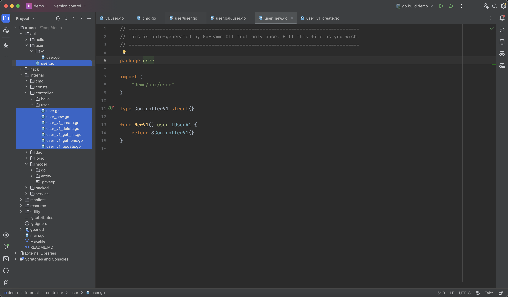

## 根据`api`生成代码

当`api`定义完成后，我们通过`make ctrl`命令（或者`gf gen ctrl`）生成控制器代码。

```text
$ make ctrl
generated: /Users/john/Temp/demo/api/user/user.go
generated: /Users/john/Temp/demo/internal/controller/user/user.go
generated: /Users/john/Temp/demo/internal/controller/user/user_new.go
generated: /Users/john/Temp/demo/internal/controller/user/user_v1_create.go
generated: /Users/john/Temp/demo/internal/controller/user/user_v1_update.go
generated: /Users/john/Temp/demo/internal/controller/user/user_v1_delete.go
generated: /Users/john/Temp/demo/internal/controller/user/user_v1_get_one.go
generated: /Users/john/Temp/demo/internal/controller/user/user_v1_get_list.go
done!
```



生成的代码主要包含`3`类文件。

## `api`接口文件

定义了`api interface`，用于保证控制器实现的接口完整，避免只实现部分接口。

```text
/Users/john/Temp/demo/api/user/user.go
```

内容如下：
```go title="api/user/user.go"
// =================================================================================
// Code generated and maintained by GoFrame CLI tool. DO NOT EDIT.
// =================================================================================

package user

import (
	"context"

	"demo/api/user/v1"
)

type IUserV1 interface {
	Create(ctx context.Context, req *v1.CreateReq) (res *v1.CreateRes, err error)
	Update(ctx context.Context, req *v1.UpdateReq) (res *v1.UpdateRes, err error)
	Delete(ctx context.Context, req *v1.DeleteReq) (res *v1.DeleteRes, err error)
	GetOne(ctx context.Context, req *v1.GetOneReq) (res *v1.GetOneRes, err error)
	GetList(ctx context.Context, req *v1.GetListReq) (res *v1.GetListRes, err error)
}
```

## `controller`路由对象管理

用于管理控制器的初始化，以及一些控制内部使用的数据结构、常量定义。

```text
generated: /Users/john/Temp/demo/internal/controller/user/user.go
generated: /Users/john/Temp/demo/internal/controller/user/user_new.go
```

其中`internal/controller/user/user.go`是一个空的源码文件，可用于定义一些内部使用的数据结构、变量等内容。
```go title="internal/controller/user/user.go"
// =================================================================================
// This is auto-generated by GoFrame CLI tool only once. Fill this file as you wish.
// =================================================================================

package user

```

另一个`internal/controller/user/user_new.go`文件是自动生成的路由对象创建文件。
```go title="internal/controller/user/user_new.go"
// =================================================================================
// This is auto-generated by GoFrame CLI tool only once. Fill this file as you wish.
// =================================================================================

package user

import (
	"demo/api/user"
)

type ControllerV1 struct{}

func NewV1() user.IUserV1 {
	return &ControllerV1{}
}
```
这两个文件都只会生成一次，随后开发者可以随意修改、扩展。

:::tip
如果后续我们需要定义`v2`接口，`make ctrl`命令会类似生成`type ControllerV2 struct{}`结构体定义，以及`func NewV2() user.IUserV2`初始化方法。
:::


## `controller`路由实现代码

用于具体的`api`接口实现的逻辑。默认情况下，会按照一个`api`接口一个源码文件的形式生成代码，也可以控制按照`api`文件定义的接口聚合生成到对应的一个源码文件中。具体的命令介绍请参考章节 [接口规范-gen ctrl](../../../docs/开发工具/代码生成-gen/接口规范-gen%20ctrl.md)。

```text
generated: /Users/john/Temp/demo/internal/controller/user/user_v1_create.go
generated: /Users/john/Temp/demo/internal/controller/user/user_v1_update.go
generated: /Users/john/Temp/demo/internal/controller/user/user_v1_delete.go
generated: /Users/john/Temp/demo/internal/controller/user/user_v1_get_one.go
generated: /Users/john/Temp/demo/internal/controller/user/user_v1_get_list.go
```

我们打开一个文件查看生成的代码模板：

```go title="internal/controller/user/user_v1_create.go"
package user

import (
	"context"

	"github.com/gogf/gf/v2/errors/gcode"
	"github.com/gogf/gf/v2/errors/gerror"

	"demo/api/user/v1"
)

func (c *ControllerV1) Create(ctx context.Context, req *v1.CreateReq) (res *v1.CreateRes, err error) {
	return nil, gerror.NewCode(gcode.CodeNotImplemented)
}
```
可以看到，这只是我们定义的创建接口的实现模板，我们完善这个路由函数的具体业务逻辑即可。
