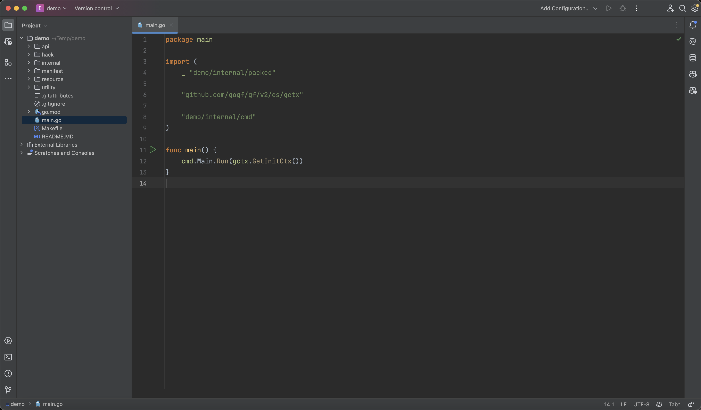
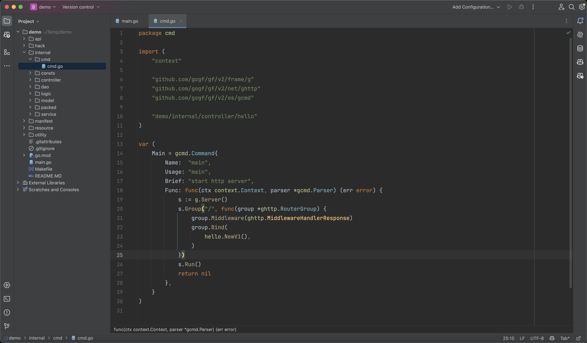
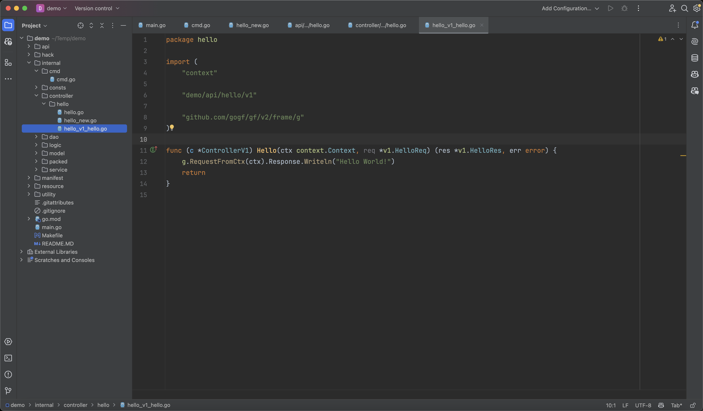
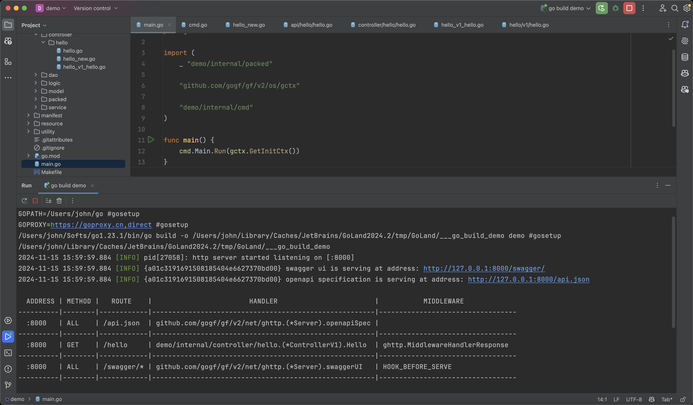

当您开始第一个项目的时候，可能对工程下面有这么多目录感觉困惑，没关系，您可以通过这个章节 [工程目录设计🔥](../../docs/框架设计/工程开发设计/工程目录设计.md) 先了解一下各个目录的作用。接下来我们会介绍一下项目是如何启动的，一个程序的启动串联了哪些目录，让大家对程序整体启动的经脉有所了解。


## main.go

所有的程序入口都是由 `main.go` 进入，该文件主要是调用 `internal/cmd` 包的对应命令引导程序启动。在项目模板中，默认会执行 `internal/cmd` 包的 `Main` 对象 `Run` 命令引导程序启动。

项目的所有的核心业务逻辑都是放到了`internal`目录下，该目录是`Golang`的特性，用于对外隐藏可见性。`internal`目录下面的代码内容将无法被外部通过`import`的方式引用，提高项目的安全性和简洁性。

:::tip
框架的核心组件均需要传递 `context` 上下文参数，这里使用 `gctx.GetInitCtx` 表示承接父进程的链路跟踪信息，如果没有父进程那么会创建一个带链路跟踪特性的 `context` 上下文对象给下游链路。
:::



## 引导启动

`Main` 对象的 `Run` 命令的主要作用是做引导启动，将一些动态初始化的逻辑放到 `Main` 的 `Run` 方法中。在项目模板中，默认创建一个 `HTTP Server`，然后通过分组路由的方式注册路由，并启动 `HTTP Server`。随后 `HTTP Server` 将会阻塞运行，它同时也会异步监听系统信号，直至收到退出信号后，它会优雅关闭连接随后退出进程。

:::tip
框架的命令行管理默认采用了结构化的对象管理方式，详细介绍感兴趣请参考章节：[命令管理](../../docs/核心组件/命令管理/命令管理.md)
:::



## 路由注册

在项目模板中使用了 `Group` 方法创建了分组路由，框架的 `HTTP Server` **支持多种路由注册方式**，而分组路由也是最常见的路由注册方式。

```go
s := g.Server()
s.Group("/", func(group *ghttp.RouterGroup) {
    group.Middleware(ghttp.MiddlewareHandlerResponse)
    group.Bind(
        hello.NewV1(),
    )
})
```

- 在分组路由的闭包方法内部，通过 `Middleware` 方法注册了一个中间件，该中间件是 `HTTP Server` 组件用于规范化路由的数据返回。
- 随后通过 `Bind` 方法的规范化路由方式绑定一个 `hello.NewV1()` 返回的路由对象，该路由对象下的所有公开方法均会被自动注册到路由。我们的项目脚手架支持接口的版本管理，默认情况下我们的路由对象都是`v1`版本，并且通过`NewV1`的方式创建。
  
:::tip
详细的HTTP Server路由介绍请参考章节： [路由管理🔥](../../docs/WEB服务开发/路由管理/路由管理.md)
:::

## 路由对象


### 对象创建
路由对象由`hello.NewV1()`方法返回，其定义如下：


可以看到`NewV1`方法其实返回的是一个接口，而不是具体的对象。该接口的定义如下：


为什么这里不直接返回`ControllerV2`对象，而是返回`hello.IHelloV1`接口呢？

试想一下，假如咱们定义了很多`api`接口，但是具体实现的`controller`只实现了其中一部分，而在运行时才能发现有缺失。那么我们如何能提前发现这个问题呢？对的，就是依赖这个接口实现。假如`controller`只实现了部分接口，那么在编译阶段就会展示错误，并且现代的编辑器中也会提前发现告警。

:::tip
首先，并不是必需这么做，脚手架模板提供的是比较严谨的代码编写方式。

其次，这里的绝大部分代码，是通过`cli`工具的`gf gen ctrl`命令自动解析`api`目录的接口定义自动生成的。
:::

### 函数定义
对应的路由函数定义如下：



`Hello` 方法对应的路由信息是定义到 `HelloReq` 输入参数对象中的，该对象的数据结构定义如下：


:::tip
这种通过统一的中间件返回统一的数据结构，统一路由对象的方法管理路由的方式，叫做**规范路由**。
更详细的介绍请参考章节：[路由注册-规范路由](../../docs/WEB服务开发/路由管理/路由管理-路由注册/路由注册-规范路由/路由注册-规范路由.md) 。
:::

## 运行服务

### 阻塞运行

通过 `HTTP Server` 的 `Run` 方法启动 `HTTP Server`，随后 `HTTP Server` 将会阻塞运行接收客户端请求，并监听进程信号，用于 `HTTP Server` 重启/关闭。

运行后，终端输出如下：



可以看到，我们启用了`API`接口文档以及`Swagger UI`。


### 查看效果

我们访问 http://127.0.0.1:8000/hello 查看接口效果：


我们访问 http://127.0.0.1:8000/swagger 查看`Swagger UI`：


## 学习小结

通过本章节的学习，我们了解了脚手架项目模板程序的执行流程。
这里其实有比较多的细节没有详细讲解，感兴趣可以了解下对应栏目下的关联文档资料。

在下一章节，我们将尝试着通过脚手架项目模板编写简单的`CURD`接口，实现对数据库表的增删查改。

