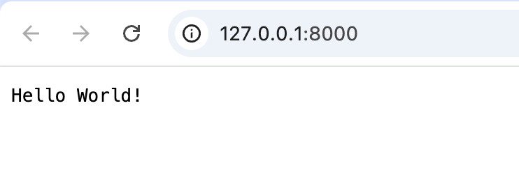

`GoFrame` is a modular framework with well-developed infrastructure, where the `Web Server` module is a core component. We will take `Web` service development as an entry point for the framework, making it easier to learn and understand.

## Hello World

Let's develop a simple `Web Server` program.

```go title="main.go"
package main

import (
    "github.com/gogf/gf/v2/frame/g"
    "github.com/gogf/gf/v2/net/ghttp"
)

func main() {
    s := g.Server()
    s.BindHandler("/", func(r *ghttp.Request) {
        r.Response.Write("Hello World!")
    })
    s.SetPort(8000)
    s.Run()
}
```
Let's look at this piece of code:
- At any time, you can obtain a default `Server` object through the `g.Server()` method, which is designed using a **singleton pattern**. This means that multiple calls to this method return the same `Server` object. The `g` component is a framework-provided coupling component that encapsulates and initializes some commonly used component objects, providing convenience for business projects.
- Bind routes and callback functions through the `BindHandler` method of the `Server` object. In this example, we bound the `/` route and specified the callback function to return `Hello World`.
- In the callback function, the input parameter is the current request object `r *ghttp.Request`, which contains the context information of the current request. In this example, we directly `Write` the return result using `r.Response`.
- Set the current `Server` listening port using the `SetPort` method. In this example, we listen to port `8000`. If no port is set, it will default to a random port.
- Execute the `Server` listening and running using the `Run()` method blocking execution.

## Execution Result

Run the program, and you will see logs similar to the following in the terminal:
```html
$ go run main.go
2024-10-27 21:30:39.412 [INFO] pid[58889]: http server started listening on [:8000]
2024-10-27 21:30:39.412 [INFO] {08a0b0086e5202184111100658330800} openapi specification is disabled

  ADDRESS | METHOD | ROUTE |     HANDLER     | MIDDLEWARE  
----------|--------|-------|-----------------|-------------
  :8000   | ALL    | /     | main.main.func1 |             
----------|--------|-------|-----------------|-------------
```

The default log output contains the following information:
- Current process ID `58889`, and the listening address `:8000` (indicating that all IP addresses of the local machine are being monitored on port `8000`).
- Since the framework comes with an automatic API documentation generation feature, it is not enabled in this example, so it prompts `openapi specification is disabled`. The automatic generation of the API documentation will be explained in detail in the corresponding chapter of the development manual, which is not covered in this example.
- Finally, the current `Server` route list is printed. Since we only monitor the `/` route, only one route information is printed here. In the route information table:
  - `ADDRESS`: Indicates the listening address of this route. The same process can run multiple `Server` instances simultaneously, with different `Server` instances listening to different addresses.
  - `METHOD`: Indicates the `HTTP Method` information that the route monitors, such as `GET/POST/PUT/DELETE`, etc. Here `ALL` signifies listening for all `HTTP Methods`.
  - `ROUTE`: Indicates the specific route address information being monitored.
  - `HANDLER`: Denotes the name of the route callback function. Since this example uses a closure function, it shows a temporary function name `main.main.func1`.
  - `MIDDLEWARE`: Indicates the name of the middleware function bound to the current route. Middleware is a classic interceptor in the `Server`, which will be explained in detail in later chapters, so it is not introduced here.

After running, try visiting http://127.0.0.1:8000/, and you will see the output on the page.



## Learning Summary

Congratulations! You have learned to use the `GoFrame` framework to develop your first `Web Server` program!

Next, we will try to obtain the parameter information submitted by the client in the `Web Server`.