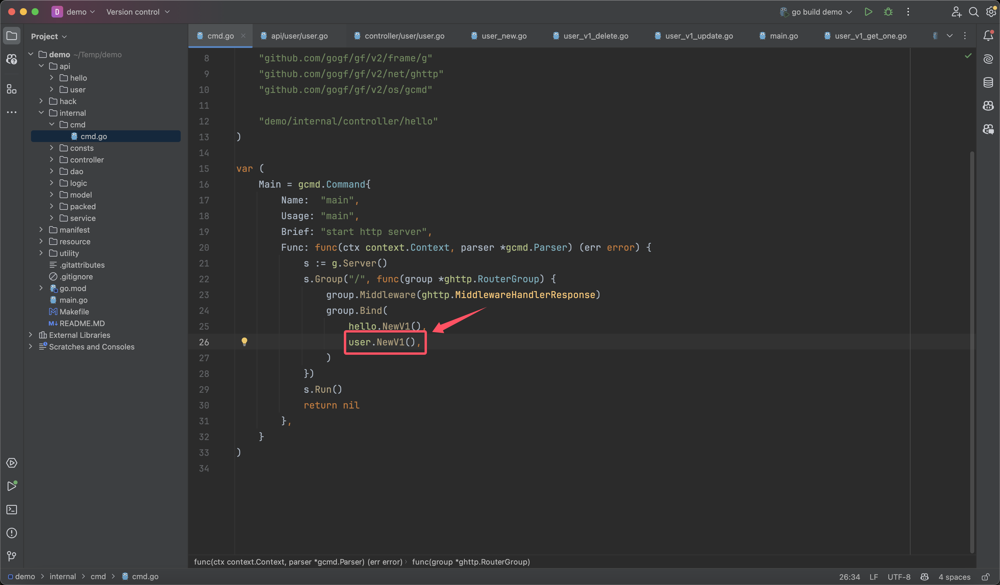

## Import Database Driver

The `GoFrame` database component uses an interface-based design, separating interface and implementation to provide better abstraction and extensibility. Here, we use the `MySQL` database, so we need to import the specific `MySQL` driver implementation. We can add `_ "github.com/gogf/gf/contrib/drivers/mysql/v2"` in `main.go`.

Sample source code: https://github.com/gogf/quick-demo/blob/main/main.go

```go title="main.go"
package main

import (
    _ "demo/internal/packed"

    _ "github.com/gogf/gf/contrib/drivers/mysql/v2"

    "github.com/gogf/gf/v2/os/gctx"

    "demo/internal/cmd"
)

func main() {
    cmd.Main.Run(gctx.GetInitCtx())
}
```

You only need to introduce the database driver once in the project; no further adjustments are needed later. For more support and detailed introduction on database drivers, please refer to the section [Database ORM](../../../docs/核心组件/数据库ORM/数据库ORM.md).

If you execute database operations without introducing the database driver, the Database ORM component will report the following error message:
```text
cannot find database driver for specified database type "mysql", did you misspell type name "mysql" or forget importing the database driver? possible reference: https://github.com/gogf/gf/tree/master/contrib/drivers
```

:::tip
In the scaffold project template `main.go`, the `import` statement contains `_ "demo/internal/packed"`, indicating the resource management of the `GoFrame` framework, which is an advanced feature. This feature allows any resource to be packaged into the binary file, so when publishing, only one binary file needs to be released. We do not use this feature here, so just understand it for now, and if you're interested, you can check out the relevant section in the development manual later.
:::

## Database Configuration

There are mainly two configuration files in the scaffold project template.

### CLI Tool Configuration `hack/config.yaml`
Introduced in previous sections, this configuration file is mainly used for local development. When the `cli` scaffold tool executes, it will automatically read the configuration content in it.

Sample source code: https://github.com/gogf/quick-demo/blob/main/hack/config.yaml

### Business Configuration `manifest/config/config.yaml`
Mainly maintains configuration information for business project components and business modules, entirely maintained by developers. This configuration file is read when the program starts. The default business configuration provided by the scaffold project template is as follows:
```yaml title="manifest/config/config.yaml"
# https://goframe.org/docs/web/server-config-file-template
server:
  address:     ":8000"
  openapiPath: "/api.json"
  swaggerPath: "/swagger"

# https://goframe.org/docs/core/glog-config
logger:
  level : "all"
  stdout: true

# https://goframe.org/docs/core/gdb-config-file
database:
  default:
    link: "mysql:root:12345678@tcp(127.0.0.1:3306)/test"
```

The default provides `3` component configurations:
- `server`: Configuration for the `Web Server`. The default listening address is `:8000`, and the API documentation feature is enabled.
- `logger`: Configuration for the default log component. The log level is set to output all logs, and all logs will be printed to standard output.
- `database`: Configuration for the database component. This is just a template; we need to modify the connection address based on the actual situation.

Each component configuration has a reference link to the official documentation for configuration. Here, we need to modify the connection information in the database configuration to match the actual usable connection information. For detailed introduction on database configuration, please refer to the section: [ORM Configuration - Configuration File](../../../docs/核心组件/数据库ORM/ORM使用配置/ORM使用配置-配置文件.md)

Sample source code: https://github.com/gogf/quick-demo/blob/main/manifest/config/config.yaml

## Add Route Registration

Adding our newly filled `API` to the route is very simple, as follows:



In the `group.Bind` method of the grouped routes, you can add our route object through `user.NewV1()`.

Sample source code: https://github.com/gogf/quick-demo/blob/main/internal/cmd/cmd.go

At this point, our interface development is complete. The next step is to start the service and perform some interface testing to see the effect.

## Learning Summary

When we use database functionality, we need to introduce the specific database driver. The `GoFrame` official repository provides driver implementations for commonly used databases in the form of community components. Our program mainly uses the business configuration, and we need to modify the database connection address within it to the address of the database we set up.

Route registration is very simple; just add a `controller` object to the group route registration through `group.Bind`.

So far, we have completed the development of the `CRUD` interface. 👏👏 We mainly focused on the following tasks:
- Database table design
- `API` interface definition
- Implementation of interface business logic
- Simple configuration and route registration

Next, let's start the program to see the effect.