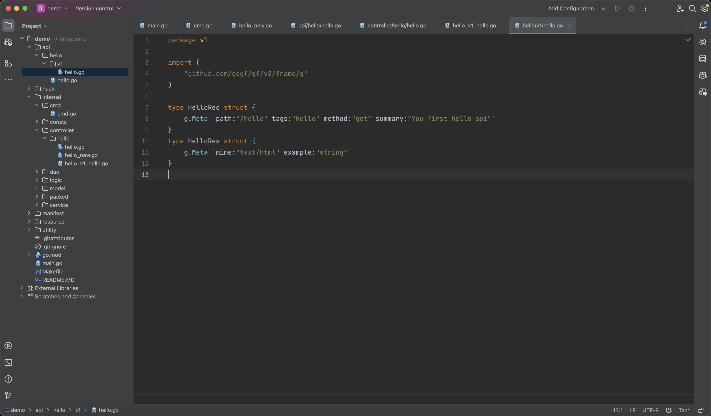

When you start your first project, you may feel confused about the many directories under the project. No worries, through this chapter [Project Directory Design🔥](../../docs/框架设计/工程开发设计/工程目录设计.md), you can understand the role of each directory. Next, we will introduce how the project is initiated and which directories are linked in the program's startup, providing an understanding of the overall startup process.

## main.go

All program entries start from `main.go`. This file mainly invokes the `internal/cmd` package's corresponding command to guide the program startup. In the project template, the default action is executing the `internal/cmd` package's `Main` object's `Run` command to guide the program startup.

All the core business logic of the project is placed in the `internal` directory, which is a feature of `Golang` designed to hide visibility from the outside. The code content under the `internal` directory cannot be imported externally, enhancing the project's security and simplicity.

:::tip
The core components of the framework need to pass the `context` context parameter. Here, `gctx.GetInitCtx` indicates inheriting the trace information of the parent process. If there is no parent process, a `context` context object with tracing features will be created for downstream linking.
:::


## Bootstrap Initialization

The main purpose of the `Run` command of the `Main` object is to perform bootstrap initialization, placing some dynamic initialization logic in the `Run` method of `Main`. In the project template, an `HTTP Server` is created by default, then routes are registered through grouped routing, and the `HTTP Server` is started. Afterwards, the `HTTP Server` will block and run, while also asynchronously listening for system signals. Upon receiving an exit signal, it will gracefully close connections and then exit the process.

:::tip
The framework's command-line management defaults to a structured object management method. For a detailed introduction, please refer to the chapter: [Command Management](../../docs/核心组件/命令管理/命令管理.md)
:::


## Route Registration

In the project template, a grouped route is created using the `Group` method. The framework's `HTTP Server` **supports multiple route registration methods**, and grouped routing is also the most common registration method.

```go
s := g.Server()
s.Group("/", func(group *ghttp.RouterGroup) {
    group.Middleware(ghttp.MiddlewareHandlerResponse)
    group.Bind(
        hello.NewV1(),
    )
})
```

- Inside the closure method of the grouped route, a middleware is registered through the `Middleware` method. This middleware is used by the `HTTP Server` component to standardize the data return of routes.
- Afterwards, a route object returned by `hello.NewV1()` is bound through the standardized route method of the `Bind` method. All public methods under this route object will be automatically registered to the route. Our project scaffold supports version management of APIs. By default, our route objects are version `v1`, created through the method `NewV1`.

:::tip
For a detailed introduction of HTTP Server routes, please refer to the chapter: [Route Management🔥](../../docs/WEB服务开发/路由管理/路由管理.md)
:::

## Route Objects


### Object Creation
Route objects are returned by the `hello.NewV1()` method, defined as follows:


As you can see, the `NewV1` method actually returns an API rather than a specific object. The API is defined as follows:


Why not return the `ControllerV1` object directly here but return the `hello.IHelloV1` API instead?

Imagine if we defined many `api` APIs, but the concretely implemented `controller` only implemented a portion of them, and we could only find this out at runtime. How could we discover this problem early? Correct, by relying on this API implementation. If the `controller` only implements part of the API, compilation will display errors, and modern editors will also alert warnings ahead of time.

:::tip
Firstly, it is not necessary to do so. The scaffold template offers a more rigorous code writing method.

Secondly, most of the code here is automatically generated by the `cli` tool's `gf gen ctrl` command by analyzing the API definition of the `api` directory.
:::

### Function Definition
The corresponding route function is defined as follows:


The route information corresponding to the `Hello` method is defined in the `HelloReq` input parameter object, whose data structure is defined as follows:



:::tip
This method of managing routes through a unified middleware that returns a uniform data structure and route objects is called **standardized routing**.
For a more detailed introduction, please refer to the chapter: [Route Registration - Standardized Routing](../../docs/WEB服务开发/路由管理/路由管理-路由注册/路由注册-规范路由/路由注册-规范路由.md).
:::

## Running the Service

### Blocking Operation

The `HTTP Server` is started through the `Run` method of the `HTTP Server`, and the `HTTP Server` will block and run, receiving client requests, and listening for process signals for `HTTP Server` restart/closure.

After running, the terminal outputs the following:


You can see that we have enabled the API documentation and `Swagger UI`.

### Viewing Results

We visit http://127.0.0.1:8000/hello to see the API results:


We visit http://127.0.0.1:8000/swagger to see the `Swagger UI`:


## Learning Summary

Through the study of this chapter, we have understood the execution process of the scaffold project template program.
There are actually a lot of details here that are not explained in depth. If interested, you can explore the relevant documentation under the corresponding section.

In the next chapter, we will try to write a simple `CRUD` API through the scaffold project template to achieve add, delete, query, and modify operations on database tables.