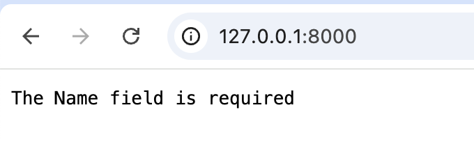

为了解决上一章节遗留的疑问：如何捕获返回的错误对象并作自定义的错误处理。
在本章节中，我们将会先简单介绍中间件的设计以及使用，再回答这个疑问。

## 中间件介绍

中间件是一种拦截器设计，在`Web Server`中可以拦截请求和返回结果，并在其前后进行自定义逻辑处理。

中间件的定义和普通的路由回调函数一样，但是可以在 `Request` 参数中使用 `Middleware` 属性对象来控制请求流程。

在中间件中执行完成处理逻辑后，使用 `r.Middleware.Next()` 方法进一步执行下一个流程；
如果这个时候直接退出不调用 `r.Middleware.Next()` 方法的话，将会退出后续的执行流程（例如可以用于请求的鉴权处理）。

## 中间件类型

中间件的类型分为两种：前置中间件和后置中间件。前置即在路由服务函数调用之前调用，后置即在其后调用。

### 前置中间件

其定义类似于：

```
func Middleware(r *ghttp.Request) {
	// 中间件处理逻辑
	r.Middleware.Next()
}
```

### 后置中间件

其定义类似于：

```
func Middleware(r *ghttp.Request) {
	r.Middleware.Next()
	// 中间件处理逻辑
}
```

## 使用中间件

我们使用中间件对上一章节的程序进行简单的改造，如下：
```go
package main

import (
	"context"

	"github.com/gogf/gf/v2/frame/g"
	"github.com/gogf/gf/v2/net/ghttp"
)

type HelloReq struct {
	g.Meta `path:"/" method:"get"`
	Name   string `v:"required" dc:"姓名"`
	Age    int    `v:"required" dc:"年龄"`
}
type HelloRes struct{}

type Hello struct{}

func (Hello) Say(ctx context.Context, req *HelloReq) (res *HelloRes, err error) {
	r := g.RequestFromCtx(ctx)
	r.Response.Writef(
		"Hello %s! Your Age is %d",
		req.Name,
		req.Age,
	)
	return
}

func ErrorHandler(r *ghttp.Request) {
    // 执行路由回调函数
	r.Middleware.Next()
    // 判断是否产生错误
	if err = r.GetError(); err != nil {
		r.Response.Write(err.Error())
		return
	}
}

func main() {
	s := g.Server()
	s.Group("/", func(group *ghttp.RouterGroup) {
		group.Middleware(ErrorHandler)
		group.Bind(
			new(Hello),
		)
	})
	s.SetPort(8000)
	s.Run()
}
```
- 我们定义了一个错误处理的中间件`ErrorHandler`，在该中间件中我们先通过`r.Middleware.Next()`执行路由函数流程，
  随后通过`r.GetError()`获取是否有错误产生。如果产生错误，那么直接输出错误信息。
- 在路由注册中，我们通过`group.Middleware(ErrorHandler)`给该分组路由下的所有注册的路由，都绑定了错误处理的中间件。

## 执行结果

运行后，我们访问 http://127.0.0.1:8000/?name=john&age=18 可以看到，页面输出结果符合预期。


我们尝试一下错误的参数请求 http://127.0.0.1:8000/ 可以看到，页面输出结果也符合预期。




